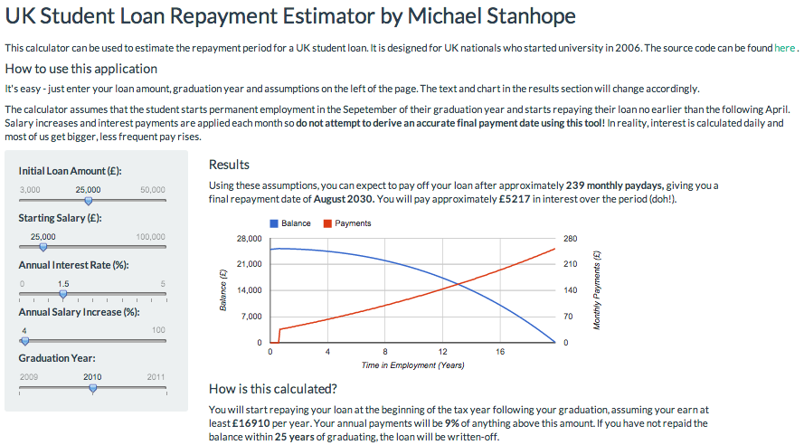

## 2. Introduction

UK students typically take out a loan to cover the costs of their studies. This loan is repaid after completion of the degree. The amount of time that it will take for a given graduate to repay their loan will depend on many factors such as:
* The starting balance
* The graduate's starting salary after entering employment
* The rate of interest applied to the loan and
* The average annual increase in the graduate's salary

I have developed an [application](https://michaelstanhope.shinyapps.io/shiny-examples/) that can be used to estimate the amount of time that it will take for a graduate to repay their loan. A user can input values for the above factors and the application will compute estimates for:
* The time that it will take to repay the loan
* The total amount of interest payments over the period

--- .class #id 
## 3. Sample output


```{r, eval=FALSE}
gvisLineChart(df,
              xvar="years", 
              yvar=c("Balance","Payments"), 
              options=list(
                  width=600,
                  height=250,
                  #title="Outstanding Balance and Monthly Payments",
                  hAxes="[{title:'Time in Employment (Years)'}]",
                  series="[{targetAxisIndex: 0},{targetAxisIndex:1}]",
                  vAxes="[{title:'Balance (£)'}, {title:'Monthly Payments (£)'}]"))
```


--- .class #id 
## 4. How it works
```{r, eval=FALSE}
sliderInput("startValue", "Initial Loan Amount (£):", 
            min = 3000, max = 50000, value = 25000, step = 100)
# This is an example of a UI widget
```

```{r, eval=FALSE}
# The server code receives the values from the UI widgets
output$repaymentPlot <- renderGvis({
        annualInterest <- input$annualInterest # input taken from the UI
        startValue <-input$startValue
```

```{r, eval=FALSE}
# The server code then does a bunch of computation (this is just a sample)
for(i in 2:length(month))
    {
        balance[i] <- balance[i-1] + monthlyInterest*balance[i-1] - monthlyPayments[i]
        total <- total + max(monthlyInterest*balance[i-1],0)
    }
```

--- .class #id 
## 5. How it works (continued)

```{r, echo=FALSE, message=FALSE}
library(googleVis)
annualInterest <- 1.5
annualIncrease <- 4
startValue <-25000
startYear <- 2010
startSalary <- 25000
month <- 1:301
minSalary <-16910
monthlyIncrease <- ((annualIncrease/100)+1)^(1/12)
monthlyInterest <- ((annualInterest/100)+1)^(1/12) -1
balance <- 0
monthlyPayments <- 0
monthlyPayments[month] <- (startSalary*(monthlyIncrease^(month)) - 21000)*0.09/12
monthlyPayments[monthlyPayments < 0] <- 0
monthlyPayments[1:8] <- 0
total <- 0
balance[1] <- startValue
for(i in 2:length(month))
{
    balance[i] <- balance[i-1] + monthlyInterest*balance[i-1] - monthlyPayments[i]
    total <- total + max(monthlyInterest*balance[i-1],0)
}
balance <- balance[balance > 0]
monthlyPayments<-monthlyPayments[1:length(balance)]
df=data.frame(years=round((index(balance)-1)/12,2), 
              Balance=round(balance), 
              Payments=round(monthlyPayments))
```

```{r, eval=FALSE}
# The UI code receives the computed results via the output object and uses them
div(htmlOutput("repaymentPlot")) # A snipet of UI code
```

```{r}
length(balance) # Gives the total repayment time (months)
```

```{r}
total # Gives the total amount of interest accumulated
```

```{r}
head(balance, 5) # Gives a running balance
```


